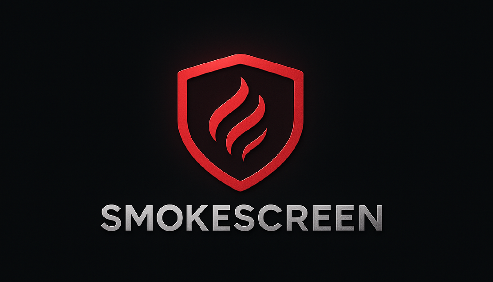
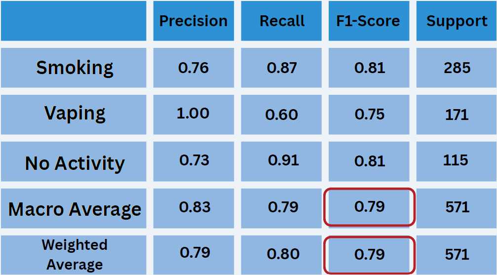

# Smoking/Vaping Detection System using YOLO + VQA + UI

## Starter Guide

### 1. Create & activate a virtual environment
- py -3.12 -m venv .venv
- .venv\Scripts\activate (Windows)
- source .venv/bin/activate (macOS/Linux)

### 2. Install dependencies
- pip install -r requirements.txt
- If pip shows **No matching distribution found for torch==2.5.1+cu121**, install via:
  `
  pip install --index-url https://download.pytorch.org/whl/cu121 \
      torch==2.5.1 torchvision==0.20.1 torchaudio==2.5.1
  `

### 3. Launch Ollama backend and download model
- ollama serve
- ollama pull qwen2.5vl:3b

### 4. Run the VQA server
- cd src
- python vqa_newest_desc_strictness.py

### 5. Start the app (UI / main pipeline)
- python main_app.py

### 6. Train and test calibration model (optional)
- python -m tools.train_logreg --root ./dataset
- python -m tools.test_logreg --root ./dataset

## Dataset structure
`
dataset/
  train/{smoking,vaping,none}
  val/{smoking,vaping,none}
  test/{smoking,vaping,none}
`

## After setup
- Open your UI or check ./out/ for logs.
